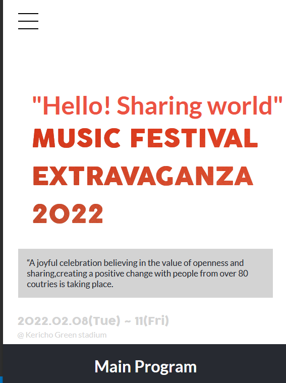
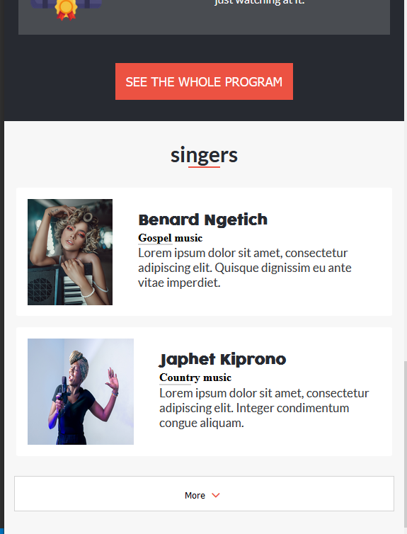
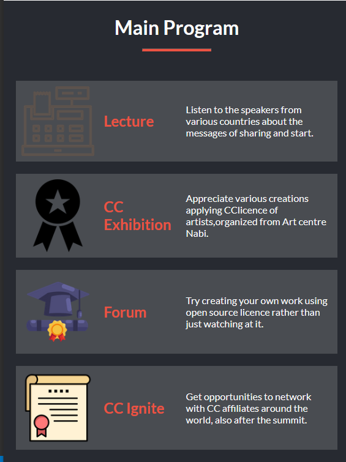

# Music Extravaganza

> "Music Extravaganza" is a Microverse requirment to complete module one of the program. The project is about musicians showcasing their talent.
> The project consists of two pages:
- Home page
- About page

- The design if from [Cindy Shin](https://www.behance.net/adagio07) The design its self can be viewed [here](https://www.behance.net/gallery/29845175/CC-Global-Summit-2015)

## Built With

- HTML-5
- CSS3
- Javacript
- Linters
- Google font awesome icons

## Live Demo
Live site URL
[Live Demo Link]()

## Project Presentation

The presentation of my project can be viewed from [here]()

## Getting Started

- To get a local copy up and running follow these simple example steps.

### Prerequisites

- You only need a browser to run the html file in.

### Setup

- Create a new folder to store the files in.

### Install

- Open your command prompt or terminal and run.
> git clone  .

### Run tests

- To run tests run :
> npx hint .
> npx stylelint "**/*.{css,scss}"
> npx eslint .

### Deployment

- Project is deployed using
> git push <branch_name>

## Authors

👤 **Author1**

- GitHub: [@telanet ](https://github.com/telanet)
- Twitter: [Ben54647605](https://twitter.com/Ben54647605)

## 🤝 Contributing

Contributions, issues, and feature requests are welcome!

## Show your support

Give a ⭐️ if you like this project!

## 📝 License

This project is [MIT](./MIT.md) licensed.